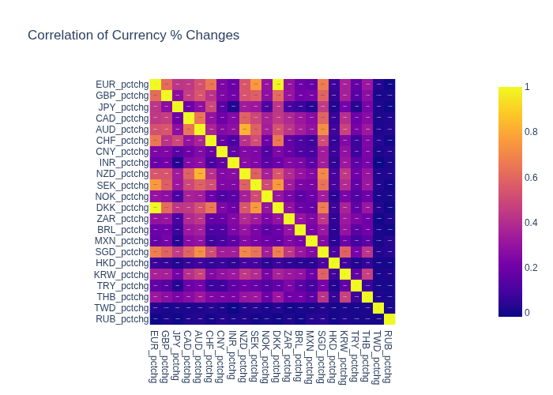

# 📊 How Events Move Markets

This project explores the relationship between **world events** and **currency markets**, using data pipelines that update automatically.

---

## 🌍 Events Impacting Currencies (via OLS)

Static snapshot:  

Interactive version:  
[👉 View Interactive Treemap](assets/treemap_events.html)

---

## 🔗 Correlation of Currency % Changes

Static snapshot:  

Interactive version:  
[👉 View Interactive Heatmap](assets/corr_heatmap.html)

---

## ⚙️ How It Works

- **Data** is pulled from [Yahoo Finance](https://finance.yahoo.com/) and your events parquet files (GDELT-derived counts).  
- **Pipelines** update automatically via GitHub Actions — visuals regenerate on each run.  
- **Analysis**: OLS regression of daily USD strength (derived from currency % changes) on daily event-type counts; treemap sizes events by coefficient magnitude and colors by sign (red = tends to strengthen USD → currencies weaken; green = tends to weaken USD → currencies strengthen).

---

✍️ Created by [Your Name](https://github.com/konak8548)  
📂 Repo: [how_events_move_markets](https://github.com/konak8548/how_events_move_markets)
