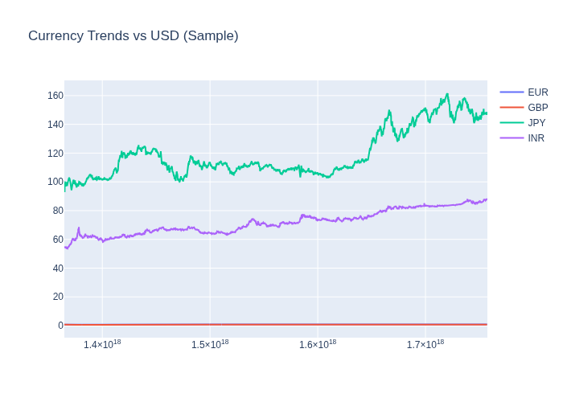

# 📊 How Events Move Markets

This project explores the relationship between **world events** and **currency markets**, using data pipelines that update automatically.

---

## 🌍 Events by Country

Static snapshot:  

Interactive version:  
[👉 View Interactive Treemap](assets/treemap_events.html)

---

## 💱 Currency Trends vs USD

Static snapshot:  

Interactive version:  
[👉 View Interactive Currency Trends](assets/currency_trends.html)

---

## 🔗 Correlation of Currency % Changes

Static snapshot:  

Interactive version:  
[👉 View Interactive Heatmap](assets/corr_heatmap.html)

---

## ⚙️ How It Works

- **Data** is pulled from [Yahoo Finance](https://finance.yahoo.com/) and [GDELT](https://www.gdeltproject.org/)  
- **Pipelines** update automatically via GitHub Actions  
- **Visuals** are regenerated and published here on every run  

---

✍️ Created by [Your Name](https://github.com/konak8548)  
📂 Repo: [how_events_move_markets](https://github.com/konak8548/how_events_move_markets)
