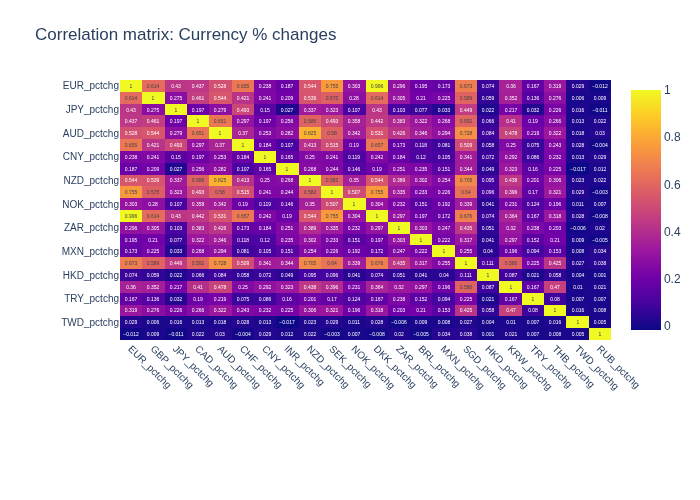

# 🌍 How Events Move Markets

This dashboard tells a story of how global events correlate with currency markets.

---

## 📌 Events Treemap
Visualizing the distribution of events by country.

  
👉 [Interactive version](assets/treemap_events.html)

---

## 💱 Currency Trends
Tracking daily exchange rates of major currencies vs USD.

  
👉 [Interactive version](assets/currency_trends.html)

---

## 🔗 Correlation of Currency Movements
Do currencies move together? Here’s a correlation heatmap of percentage changes.

  
👉 [Interactive version](assets/corr_heatmap.html)

---

✍️ *Auto-generated daily using GitHub Actions.*
